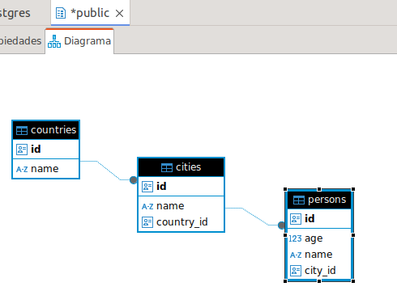

# Demo ResultSet + JOSSON

## Problema a resolver

Muchas veces encontramos que una query customizada por varios campos a varias tablas nos devuelve una estructura de tuplas.

imaginemos estas 3 tablas:



If we query using one shot (so, do not iterate over jpa) using jdbcTemplate :


```java

String query = """
		SELECT 
	    countries.id as country_id,
	    cities.id as city_id,
	    persons.name as person_name,
	    persons.age as person_age
	    
	FROM persons
	
	INNER JOIN cities  
	ON persons.city_id = cities.id
	
	INNER JOIN countries 
	ON cities.country_id = countries.id
	
	limit 10 offset 0
	;
   """;


return ResponseEntity.ok(jdbcTemplate.queryForList(query));

```

You will get a flat list of tuples  like this:

```json

 [
    {
        "country_id": "e5f5a892-5d96-5a5a-00a8-9dfe5e1a0b01",
        "city_id": "5c6d7e8f-9a0b-1c2d-3e4f-5a6b7c8d9e00",
        "person_name": "Paco",
        "person_age": 50
    },
    {
        "country_id": "e5f5a892-5d96-5a5a-00a8-9dfe5e1a0b01",
        "city_id": "5c6d7e8f-9a0b-1c2d-3e4f-5a6b7c8d9e00",
        "person_name": "Luis",
        "person_age": 25
    },
 
 ```

**But we want the default tree structure that we obtain using jpa entities (like this)** 

```json
[
    {
        "id": "e5f5a892-5d96-5a5a-00a8-9dfe5e1a0b01",
        "cities": [
            {
                "id": "5c6d7e8f-9a0b-1c2d-3e4f-5a6b7c8d9e00",
                "persons": [
                    {
                        "name": "Paco",
                        "age": 50
                    },
                    {
                        "name": "Luis",
                        "age": 25
                    },
                    {
                        "name": "Maria",
                        "age": 14
                    }
                ]
            },
```

## The solution

Mix the resultSet out with the Josson processing using **group and map** features:

```java


		Josson josson = Josson.from(jdbcTemplate.queryForList(query));

		String exp = "group(country_id)"
				+ "			.map( id: country_id,"
				+ "				  cities: elements.group(city_id)"
				+ "												.map(id: city_id,"
				+ "										 			 persons:elements.map(name:person_name, "
				+ "																		  age: person_age)))";

		var result = josson.getNode(exp);
		
		return ResponseEntity.ok(result);


```

# Execution

## Prepare infrastructure

 {dir}/infrastruture -> docker-compose up


## Run the application

mvn clean install spring-boot:run 

(schema sql and data initalization will be executed :-D)

## Execute:

curl http:// localhost:8080/query

and get the desired result:

```sh 
$ curl http:// localhost:8080/query | jq .

[
  {
    "id": "e5f5a892-5d96-5a5a-00a8-9dfe5e1a0b01",
    "cities": [
      {
        "id": "5c6d7e8f-9a0b-1c2d-3e4f-5a6b7c8d9e00",
        "persons": [
          {
            "name": "Maria",
            "age": 14
          },
          {
            "name": "Luis",
            "age": 25
          },
          {
            "name": "Paco",
            "age": 50
          }
        ]
      },
      {
        "id": "5c6d7e8f-9a0b-1c2d-3e4f-5a6b7c8d9e01",
        "persons": [
          {
            "name": "Pedro",
            "age": 35
          }
        ]
      },
      {
        "id": "5c6d7e8f-9a0b-1c2d-3e4f-5a6b7c8d9e02",
        "persons": [
          {
            "name": "Lourdes",
            "age": 67


...
...

```

